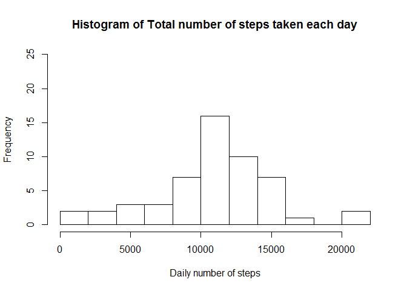
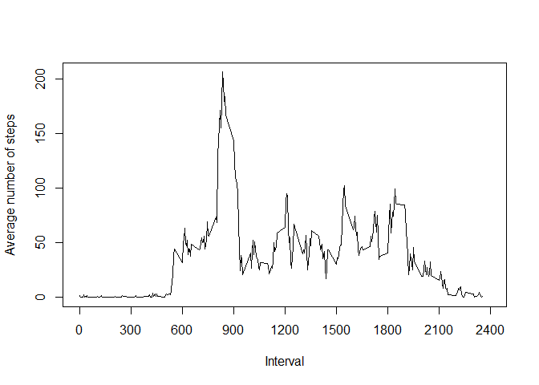
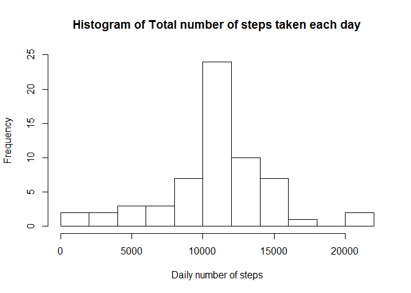
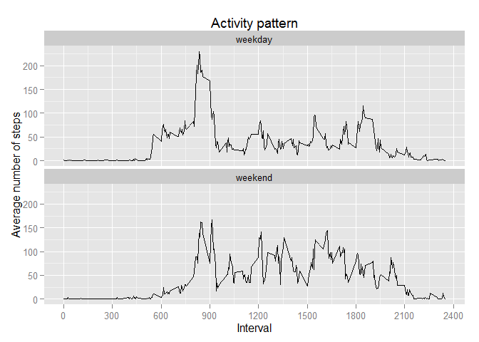

# Reproducible Research: Peer Assessment 1
Author: Frederic Grenier (mitienka)  

## Loading and preprocessing the data  


```r
        # load the data into a data frame
        activitydata <- read.csv(unz("activity.zip","activity.csv"))
        # convert the date from factor to date class
        activitydata$date <- as.Date(activitydata$date, "%Y-%m-%d")
```

## What is mean total number of steps taken per day?  


```r
        library(plyr)
        dailysteps <- ddply(activitydata,.(date),summarize,dailytotal=sum(steps))

        hist(dailysteps$dailytotal, breaks=12, main="Histogram of Total number of steps taken each day", 
             xlab="Daily number of steps", ylim=c(0,25))        
```

 

```r
        meansteps <- mean(dailysteps$dailytotal,na.rm=TRUE)
        mediansteps <- median(dailysteps$dailytotal,na.rm=TRUE)
```

  The mean total number of steps taken per day is : **10766.189**  
  The median total number of steps taken per day is : **10765**  

## What is the average daily activity pattern?  


```r
        intervalsteps <- ddply(activitydata,.(interval),summarize,
                               intervalmean=mean(steps,na.rm=TRUE))
        plot(intervalsteps$interval,intervalsteps$intervalmean,type="l",main="",
             xlab="Interval", xlim=c(0,2400), xaxt="n", ylab="Average number of steps")
        axis(1,at=seq(0,2400,by=300))
```

 

```r
        intervalMaxAverage <- intervalsteps[intervalsteps$intervalmean==max(intervalsteps$intervalmean),]$interval
```

  The 5-minute interval containing the maximum number of steps, averaged across 
  all days, is interval **835**  


## Imputing missing values  

### Determining the total number of rows with missing data  

```r
        compcases <- complete.cases(activitydata)
        incompleteRows <- length(compcases)-sum(compcases)
```
  There is 2304 rows with missing data.

### Filling strategy  
Since there is 8 entire days with missing values, we will use the mean of the 
5-minute interval to fill the rows where no values were recordered.

The mean values for 5-minute interval is already stored in the `intervalsteps` data frame.


```r
# For each row of the data frame with NA in steps, replace it with the 
# corresponding interval mean value
        fillNA <- function(data,values){
            b <- 0
                for(i in 1:nrow(data)){
        	        if(is.na(data[i,]$steps)){
        		  data[i,]$steps <- values[values$interval==data[i,]$interval,]$intervalmean
        		  b <- b+1
        		}
        	}
           cat(b, "rows updated.")
           data
        }  

        filleddata <-fillNA(activitydata,intervalsteps)
```

```
## 2304 rows updated.
```

The new dataset with missing data filled in is `filleddata`  
  
### Impact of imputing missing values


```r
        library(plyr)
        daystepsFilled <- ddply(filleddata,.(date),summarize,dailytotal=sum(steps))

        hist(daystepsFilled$dailytotal, breaks=12, main="Histogram of Total number of steps taken each day", 
             xlab="Daily number of steps", ylim=c(0,25))        
```

 

```r
        meanstepsF <- mean(daystepsFilled$dailytotal)
        medianstepsF <- median(daystepsFilled$dailytotal)
```
Using the new dataset, the mean total number of steps taken per day is : 
**10766.189**  
The new median total number of steps taken per day is : 
**10766.189**  
  
  
The distribution of the daily number of steps remain similar except that
there is now 8 more days with a number of steps equal to the average.  

The average number of steps remains the same but the median is now equal to the 
mean in our data set.  

The impact of the method used to imput missing data is an increase the weight of 
the average values in the distribution of the total number of steps per day.  
  
  
  
## Are there differences in activity patterns between weekdays and weekends?

As I work in a non-English environment, I change the system locale to facilitate 
readability.

```r
        # Changing the locale to use the english weekdays
        Sys.setlocale("LC_ALL","English")  
```

```
## [1] "LC_COLLATE=English_United States.1252;LC_CTYPE=English_United States.1252;LC_MONETARY=English_United States.1252;LC_NUMERIC=C;LC_TIME=English_United States.1252"
```

Adding factor variable weekday/weekend


```r
        # create character vector of weekdays
        day <- weekdays(Sys.Date()+0:6)  

        # convert vector to dataframe
        weekdayDF <- data.frame(day)
        weekdayDF$weektime <- 0

        # loop to add the type of day : weekday/weekend
        for(i in 1:nrow(weekdayDF)){
                if(weekdayDF[i,]$day=="Sunday" | weekdayDF[i,]$day=="Saturday"){
		        weekdayDF[i,]$weektime <- c("weekend")
	        }
	        else{
		        weekdayDF[i,]$weektime <- c("weekday")
	        }
        }

        # add new variable to data frame and loop to set it 
        filleddata$weektime <- 0
        for(i in 1:nrow(filleddata)){
                filleddata[i,]$weektime <- 
                        weekdayDF[weekdayDF$day==weekdays(filleddata[i,]$date),]$weektime
        }

        # average the total number of steps per interval across weekday/weekend
        intervalStepsWeektime <- ddply(filleddata,.(interval,weektime),summarize,
                               intervalmean=mean(steps))
```

Creation of the two-panel plot using the ggplot2 library.


```r
        # create panel plot of the activity pattern for weekday/weekend
        library(ggplot2)  

        activitypattern <- ggplot(intervalStepsWeektime, aes(interval,intervalmean))  

        activitypattern + geom_line() + scale_x_continuous(breaks=seq(0,2400,300)) + facet_wrap(~weektime,nrow=2) + labs(title="Activity pattern", y="Average number of steps", x="Interval")
```

 
  
By looking at the above plot, one can conclude that the activity level per 
interval varies between weekdays and weekends.

For example, there is more activity before the 750 interval during weekdays. During 
weekends, there is much more intervals with an average number of steps over 50.

One might conclude that the person monitored has a sedentary job and is more active 
during weekends.
