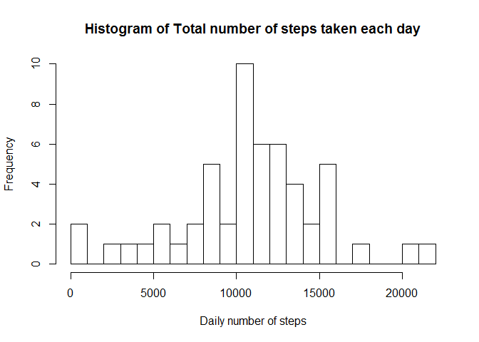
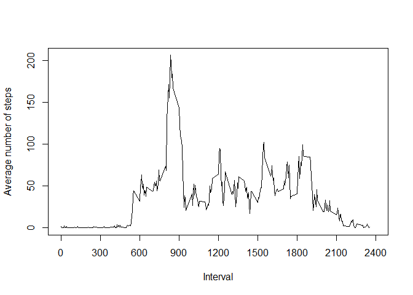
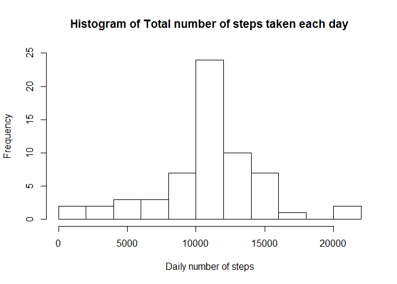

# Reproducible Research: Peer Assessment 1
Author: Frederic Grenier (mitienka)  

## Loading and preprocessing the data  


```r
        # load the data into a data frame
        activitydata <- read.csv(unz("activity.zip","activity.csv"))
        # convert the date from factor to date class
        activitydata$date <- as.Date(activitydata$date, "%Y-%m-%d")
```

## What is mean total number of steps taken per day?  


```r
        library(plyr)
        dailysteps <- ddply(activitydata,.(date),summarize,dailytotal=sum(steps))

        hist(dailysteps$dailytotal, breaks=12, main="Histogram of Total number of steps taken each day", 
             xlab="Daily number of steps", ylim=c(0,25))        
```

 

```r
        meansteps <- mean(dailysteps$dailytotal,na.rm=TRUE)
        mediansteps <- median(dailysteps$dailytotal,na.rm=TRUE)
```

  The mean total number of steps taken per day is : **10766.189**  
  The median total number of steps taken per day is : **10765**  

## What is the average daily activity pattern?  


```r
        intervalsteps <- ddply(activitydata,.(interval),summarize,
                               intervalmean=mean(steps,na.rm=TRUE))
        plot(intervalsteps$interval,intervalsteps$intervalmean,type="l",main="",
             xlab="Interval", xlim=c(0,2400), xaxt="n", ylab="Average number of steps")
        axis(1,at=seq(0,2400,by=300))
```

 

```r
        intervalMaxAverage <- intervalsteps[intervalsteps$intervalmean==max(intervalsteps$intervalmean),]$interval
```

  The 5-minute interval containing the maximum number of steps, averaged across 
  all days, is interval **835**  


## Imputing missing values  

### Determining the total number of rows with missing data  

```r
        compcases <- complete.cases(activitydata)
        incompleteRows <- length(compcases)-sum(compcases)
```
  There is 2304 rows with missing data.

### Filling strategy  
Since there is 8 entire days with missing values, we will use the mean of the 
5-minute interval to fill the rows where no values were recordered.

The mean values for 5-minute interval is already stored in the *intervalsteps* data frame.


```r
# For each row of the data frame with NA in steps, replace it with the 
# corresponding interval mean value
        fillNA <- function(data,values){
            b <- 0
                for(i in 1:nrow(data)){
        	        if(is.na(data[i,]$steps)){
        		  data[i,]$steps <- values[values$interval==data[i,]$interval,]$intervalmean
        		  b <- b+1
        		}
        	}
           cat(b, "rows updated.")
           data
        }  

        filleddata <-fillNA(activitydata,intervalsteps)
```

```
## 2304 rows updated.
```

The new dataset with missing data filled in is *filleddata*  
  
### Impact of imputing missing values


```r
        library(plyr)
        daystepsFilled <- ddply(filleddata,.(date),summarize,dailytotal=sum(steps))

        hist(daystepsFilled$dailytotal, breaks=12, main="Histogram of Total number of steps taken each day", 
             xlab="Daily number of steps", ylim=c(0,25))        
```

 

```r
        meanstepsF <- mean(daystepsFilled$dailytotal,na.rm=TRUE)
        medianstepsF <- median(daystepsFilled$dailytotal,na.rm=TRUE)
```
Using the new dataset, the mean total number of steps taken per day is : 
**10766.189**  
The new median total number of steps taken per day is : 
**10766.189**  
  
  
The histogram remain similar except for the
The days with the data filled in have a total number of steps equal to the 
average number of steps in the original data set.  
Thus, the mean remains the same as we have replaced days not accounted for with
days having a total number of steps equal to the daily mean.
The median is now equal to the mean.

Our method to fill in missing data increases the 


## Are there differences in activity patterns between weekdays and weekends?
